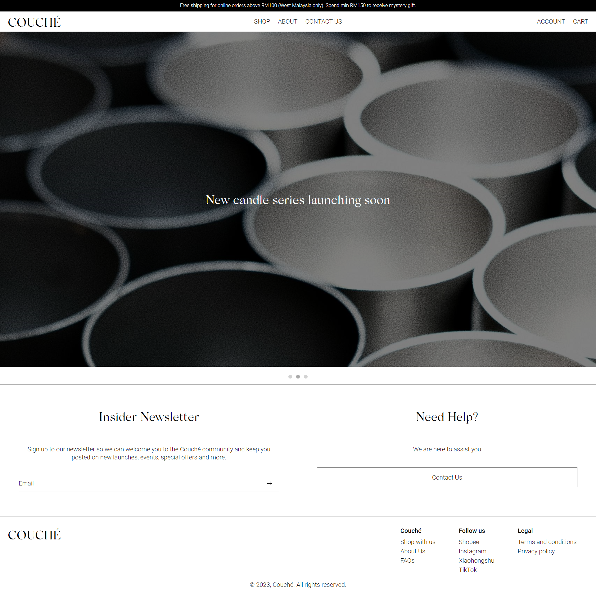
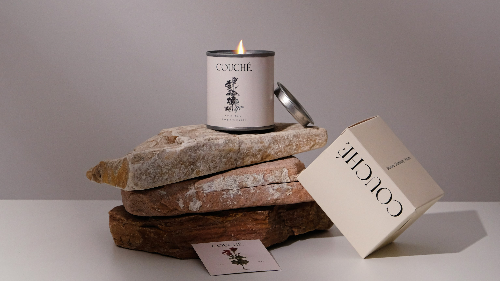

# Couché

This website showcases Couché and its products, as well as providing information on the brand's background, product range, and contact details. Crafted with HTML, CSS, and JavaScript, the site is designed to offer a seamless user experience and was last updated on December 22, 2023.

[Live website](https://kahgin.github.io/couche/home.html)

## About the Brand

Couché, a Malaysian candle brand established in 2021, is renowned for its high-quality, natural soy wax candles. Each candle is hand-poured in small batches, ensuring unparalleled quality and care. Couché has earned a notable certification from the International Fragrance Association (IFRA), affirming its commitment to exceptional product quality and safety standards. The brand offers a wide range of enchanting scents ranging from delicate florals and luscious fruits to rich, woody fragrances, making them perfect for enhancing the ambiance of any space. Whether you're looking to create a cozy, relaxing atmosphere or searching for a thoughtful gift, Couché candles offer something special for everyone.

[Instagram](https://www.instagram.com/couche.official/) | [XiaoHongShu](https://www.xiaohongshu.com/user/profile/5d58d6a400000000010043c2?xhsshare=CopyLink&appuid=5d58d6a400000000010043c2&apptime=1651233307) | [Shopee](https://shopee.com.my/shop/3004642?af_click_lookback=7d&af_reengagement_window=7d&af_siteid=an_12180650000&af_sub_siteid=3004642----&is_retargeting=true&pid=affiliates&utm_campaign=-&utm_content=3004642----&utm_medium=affiliates&utm_source=an_12180650000&utm_term=asmkrkm3vhzo)

## Features of the Website

:candle: Home Page

:candle: About Us

:candle: List of Products

:candle: Product's Details

:candle: Log In, Sign Up & Forgot Password

:candle: Contact Us

:candle: FAQ, Terms and Conditions & Privacy Policy